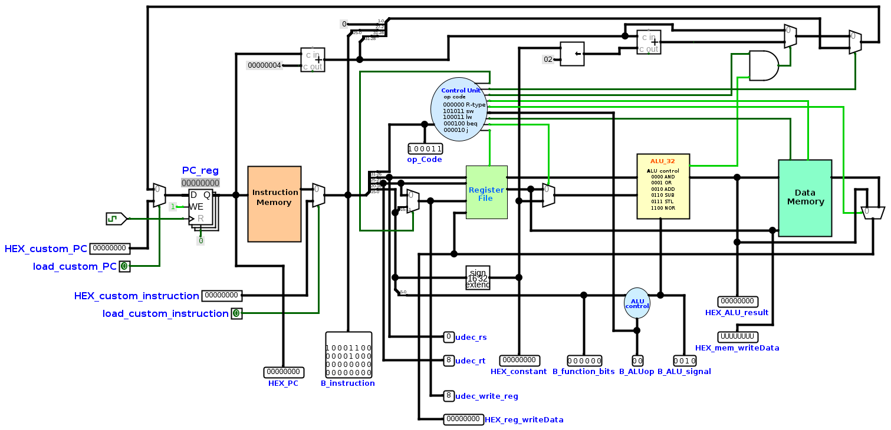
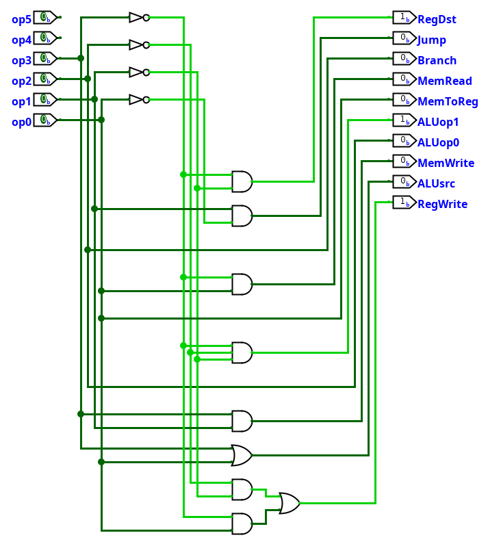
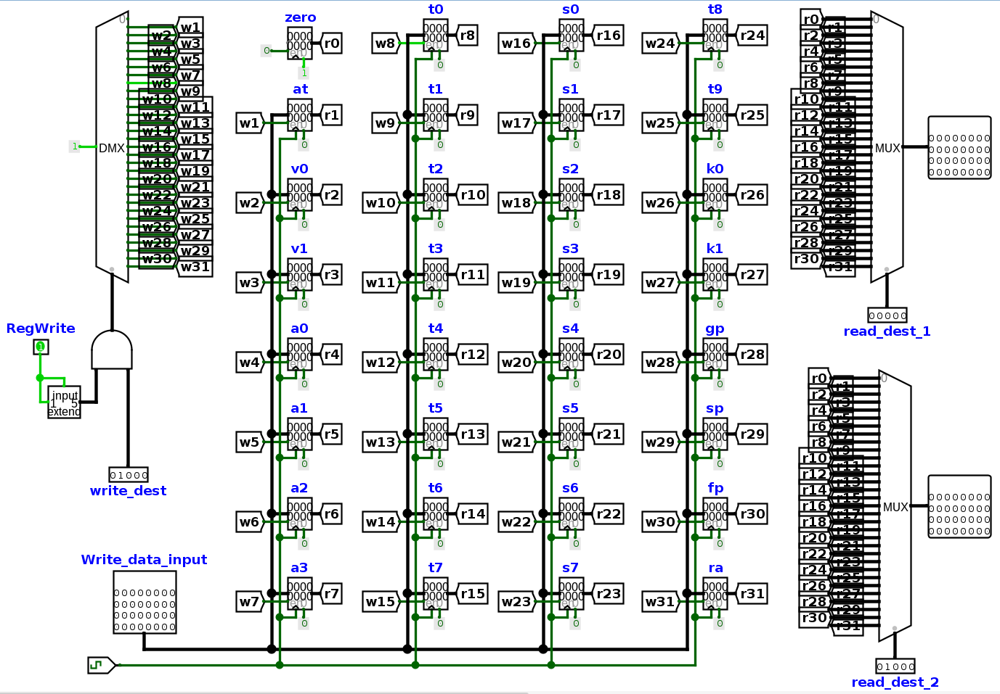
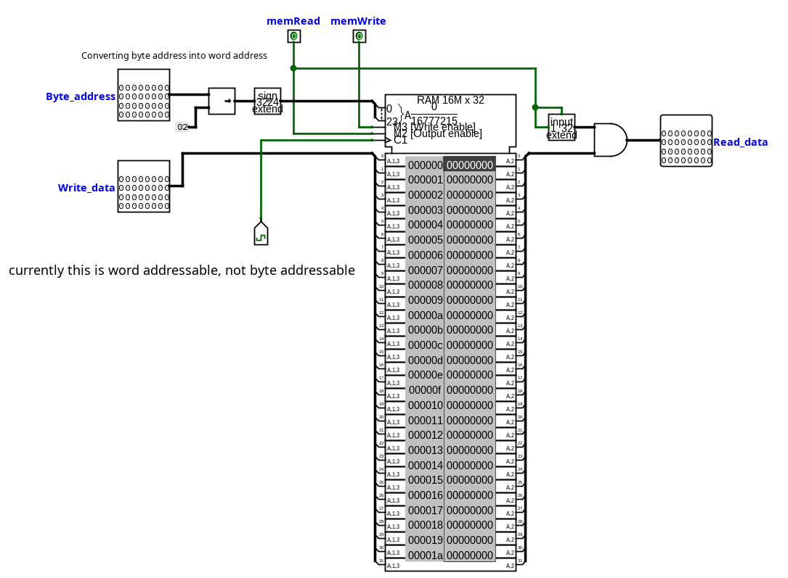
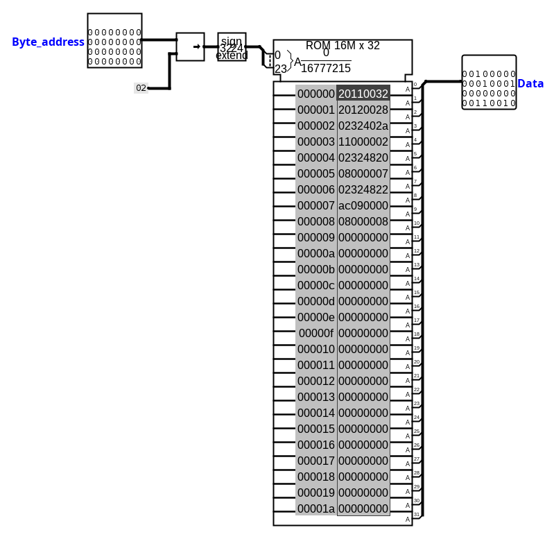

# MIPS (RISC Processor) on logisim-simulator
In this repo you will find logisim software (.jar file) and MIPS (.circ file). <br>
Reference for making our MIPS is class notes <br>

### Following instructions are implemented
1. **R-Type** : add, sub, and, or, slt
2. **I-Type** : lw, sw, beq, addi
3. **J-Type** : j
4. **Pseudo** : subi, move

#### Using ROM as Instruction memory and RAM as Data memory

## Pre-requisites 
1. Java installed on your system
2. Basic knowledge of logisim simulator

## To run MIPS on simulator
1. Clone git repo
```bash
git clone https://github.com/shreekar2005/MIPS_processor.git
```
2. Go to project location
```bash
cd MIPS_processor/mips_logisim
```
3. Run following command to run logisim with our MIPS as project
```bash
java -jar logisim-evolution-4.0.0-all.jar MIPS_processor.circ
```
4. Load Instruction Memory (ROM) with its image located at ```/test_program_<ProgramNum>/instruction_memory``` (if ROM is not initialized)
5. Load Data Memory (RAM) with its image located at ```/test_program_<ProgramNum>/data_memory```
6. For more information about program, Read ```/test_program_<ProgramNum>/about_program.txt```
7. Start simulation

## To create new program to run on processor
1. create folder say `programx`
2. create `programx/main.asm` and write assembly code in `main.asm` (you can only use `.data`, `.text`, `.word`, implemented instructions, can create labels)
3. assember your program using assembler.cpp (first compile it using Makefile)
4. you may refer to some programs which are given in this repo (just to understand how to write MIPS assembly code)


## Some Screen Shots
### 1. Overall MIPS <br>

### 2. Control Unit Circuit <br>

### 3. Register File <br>

### 4. Data Memory <br>

### 5. Instruction Memory <br>

